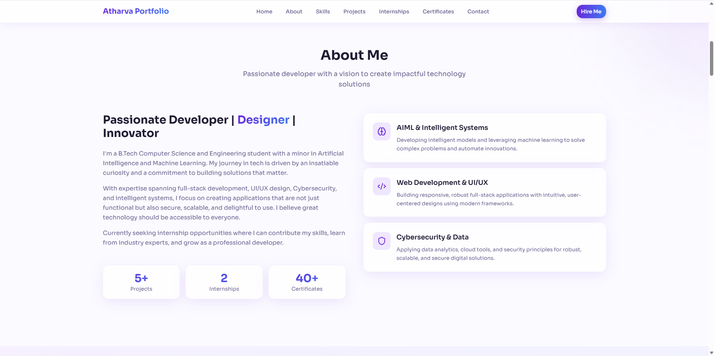
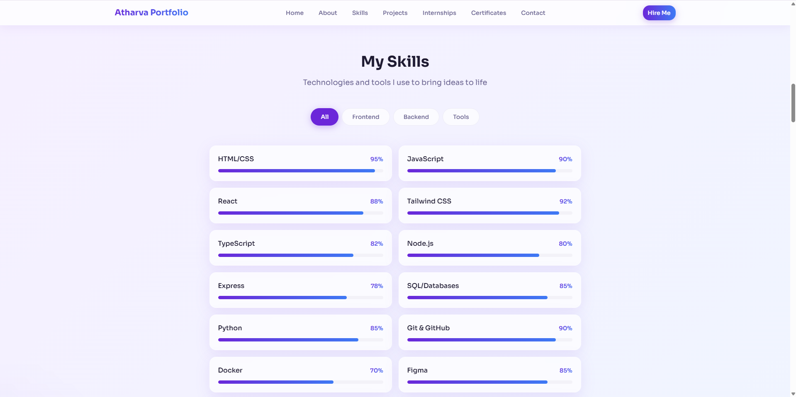
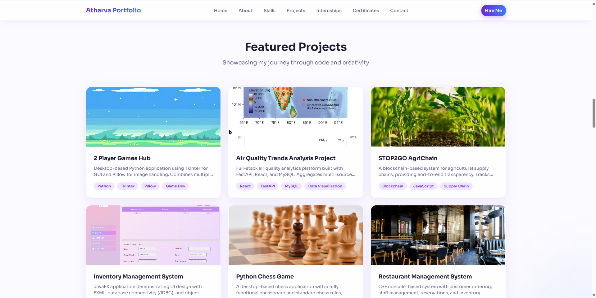
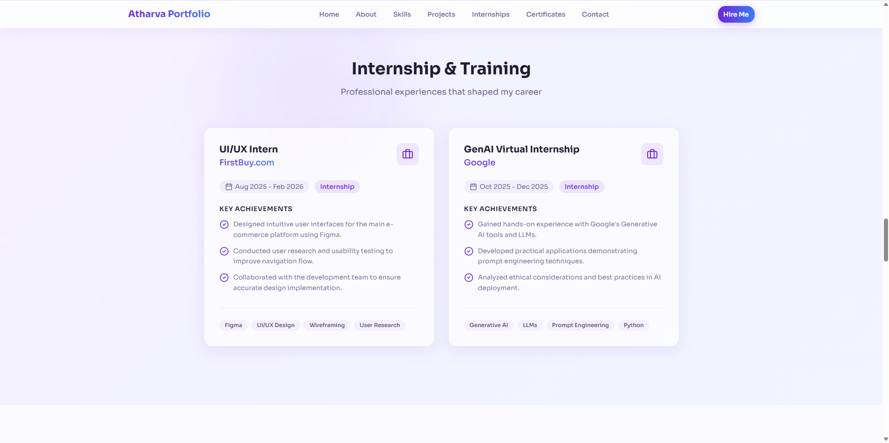
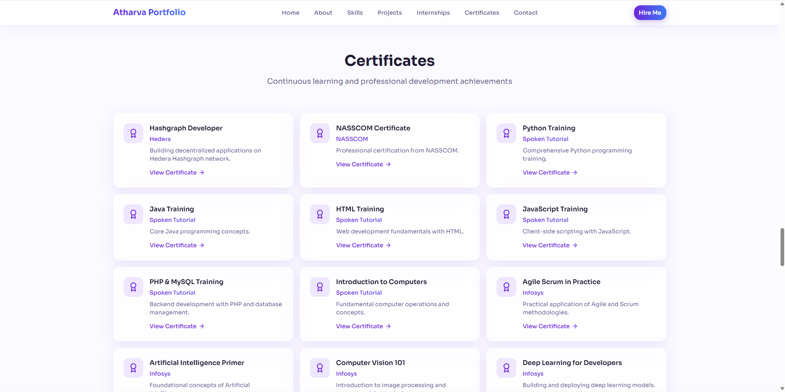
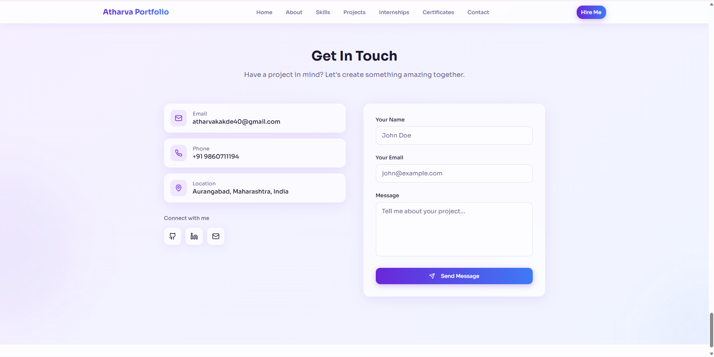

# 🌐 Atharva Kakde – Developer Portfolio

<p align="center">
  
  
  
  
  
</p>

🚀 A modern, responsive personal portfolio website showcasing my skills, projects, internships, and certifications.

🔗 **Live Website:**  
👉 https://atharva-kakde-portfolio.vercel.app/

---

## 👋 About Me

Hi, I’m **Atharva Kakde**, a **B.Tech Computer Science & Engineering** student with a minor in **Artificial Intelligence & Machine Learning**.

- 💻 Full-Stack Developer  
- 🎨 UI/UX Designer  
- 🤖 AI/ML Enthusiast  
- 🌱 Actively seeking **internship opportunities**

---

## 🖼️ Screenshots

### 🏠 Hero Section


### 👨‍💻 About Me


### 🛠️ Skills


### 🚀 Projects


### 🎓 Internships & Certificates



### 📬 Contact


---

## ✨ Features

- 🎯 Clean & modern UI design
- 📱 Fully responsive across devices
- 🧠 Skills displayed with progress indicators
- 💼 Internship & training showcase
- 🏆 Certificates section
- 📬 Contact form for collaboration
- ⚡ Deployed on Vercel for fast performance

---

## 🛠️ Tech Stack

### Frontend
- React
- JavaScript
- HTML5
- CSS3
- Tailwind CSS

### Backend & Database
- Node.js
- Express.js
- MySQL / SQL

### Tools & Platforms
- Git & GitHub
- Figma (UI/UX Design)
- Docker
- Vercel

---

## 📂 Featured Projects

- 🎮 **2 Player Games Hub** – Python Tkinter desktop application  
- 🌍 **Air Quality Trends Analysis** – React, FastAPI, MySQL  
- 🌱 **STOP2GO AgriChain** – Blockchain-based supply chain system  
- 📦 **Inventory Management System** – JavaFX & JDBC  
- ♟️ **Python Chess Game** – Desktop chess application  
- 🍽️ **Restaurant Management System** – C++ console-based system  

---

## 🚀 Getting Started (Local Setup)

```bash
git clone https://github.com/atharvakakde/AtharvaKakde-Portfolio.git
cd AtharvaKakde-Portfolio
npm install
npm start
